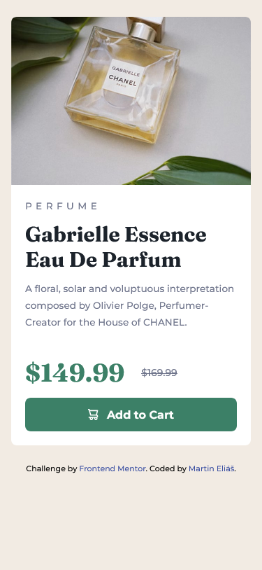

# Frontend Mentor - Product preview card component solution

This is a solution to the [Product preview card component challenge on Frontend Mentor](https://www.frontendmentor.io/challenges/product-preview-card-component-GO7UmttRfa). Frontend Mentor challenges help you improve your coding skills by building realistic projects.

## Table of contents

- [Overview](#overview)
  - [The challenge](#the-challenge)
  - [Screenshot](#screenshot)
  - [Links](#links)
- [My process](#my-process)
  - [Built with](#built-with)
  - [What I learned](#what-i-learned)
- [Author](#author)

## Overview

### The challenge

Users should be able to:

- View the optimal layout depending on their device's screen size
- See hover and focus states for interactive elements

### Screenshot

### Links

- Solution URL: [https://www.frontendmentor.io/solutions/product-preview-card-with-tailwind-V6BmCGHxUL](https://www.frontendmentor.io/solutions/product-preview-card-with-tailwind-V6BmCGHxUL)
- Live Site URL: [https://product-preview-card-component-main-zeta.vercel.app/](https://product-preview-card-component-main-zeta.vercel.app/)

## My process

### Built with

- Semantic HTML5 markup
- CSS custom properties
- Flexbox
- Mobile-first workflow
- [Tailwind](https://tailwindcss.com/) - CSS Framework

### What I learned

First time using tailwind css framework. I have learned how to use it on simple task with media queries also.

## Author

- Frontend Mentor - [@martinelias1312](https://www.frontendmentor.io/profile/martinelias1312)
- Twitter - [@MartinEliáš](https://www.linkedin.com/in/martin-eli%C3%A1%C5%A1-455550209/)
